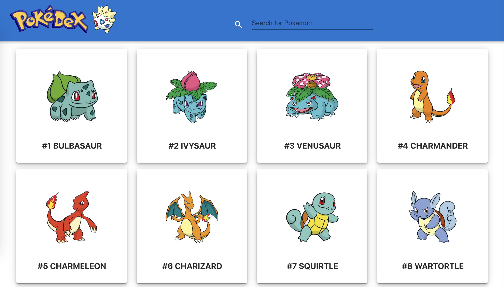
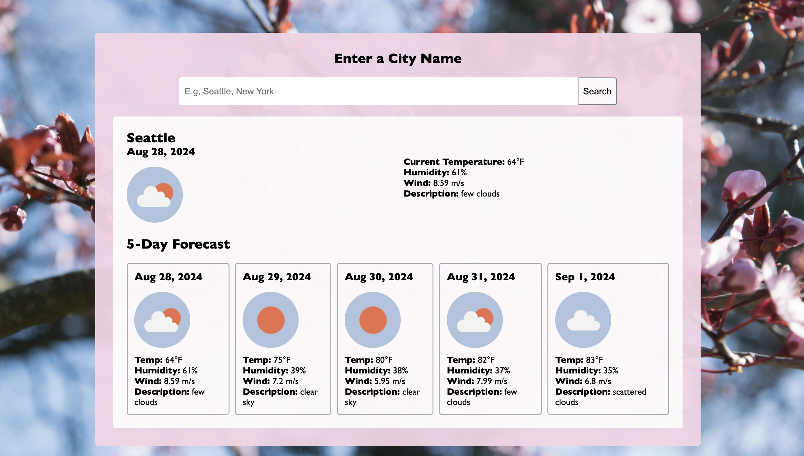

# Meghan Mullally's Portfolio

[My portfolio](https://meghanmullally-portfolio.netlify.app/) highlights my ongoing journey in web development. Explore to learn more about my skills and projects, and don’t hesitate to get in touch!

## 📑 Table of Contents

- [About](#about)
- [Technologies Used](#technologies-used)
- [Features](#features)
- [Projects](#projects)
- [Contact](#contact)

## 👩‍💻 About

This portfolio is a reflection of my journey in tech, showcasing projects I've worked on and my skills in front-end and full-stack development. It also highlights my experience in technical support and customer service, emphasizing my ability to blend technical expertise with customer-focused problem-solving.

## 🛠️ Technologies Used

- **Frontend**: 
      
- **Styling**: 
     
- **Deployment**: 
  

## ✨ Features

- **Responsive Design**: Optimized for both desktop and mobile devices.
- **Dynamic Content**: Showcases my latest projects and skills dynamically.
- **Contact Form**: Allows visitors to send me messages directly through the website.
- **Accessibility**: Built with accessibility in mind to ensure a great experience for all users.
- **Performance**: Optimized for fast loading speeds and efficient performance.

## 🚀 Projects 

Check out my recent projects that highlight my skills in web development. Explore the live demos and code!

### 🐾 1. Pokémon App 

- **Description**: After a break of 2.5 years, I decided to get back into coding with a project centered around Pokémon. This application is built using React.js, JavaScript, Redux, and Material UI. The goal of this project was to reacquaint myself with coding and pick up new skills, like Redux.
- **Live App**: [poketrainercentral.netlify.app](https://poketrainercentral.netlify.app)
- **GitHub**: [Github repo](https://github.com/meghanmullally/pokemon)

### ☕️ 2. Meghan's Cafe

- **Description**: Welcome to Meghan's Cafe! This project showcases a simple restaurant menu with an order form. It's part of the final project for the HTML course on Codédex.
- **Live App**: [Meghan's Cafe](https://www.codedex.io/@meghansm/build/meghans-cafe)
- **GitHub**: [Github repo](https://github.com/meghanmullally/cafe)

### 🌤️ 3. Weather App

- **Description**: The Weather App displays the current weather of a searched city along with a 5-day forecast. It's part of the final project for the JavaScript course on Codédex.
- **Live App**: [Weather App](https://weather-bice-theta.vercel.app/)
- **GitHub**: [Github repo](https://github.com/meghanmullally/weather)

## 📬 Contact 

Feel free to reach out if you have any questions or opportunities you'd like to discuss:

   